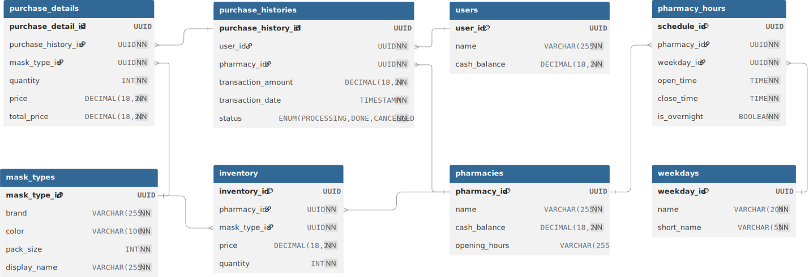

# Response - Test Version
> 基於 phantom_mask_bu2 backend 專案的功能分析與實作報告

## Requirement Completion Rate
* [x] List pharmacies, optionally filtered by specific time and/or day of the week.
  * Implemented at `POST /stores/search` API.
* [x] List all masks sold by a given pharmacy with an option to sort by name or price.
  * Implemented at `POST /stores/inventory` API.
* [x] List all pharmacies that offer a number of mask products within a given price range, where the count is above, below, or between given thresholds.
  * Implemented at `POST /stores/filter-by-price-quantity` API.
* [x] Show the top N users who spent the most on masks during a specific date range.
  * Implemented at `POST /stores/top-spenders` API.
* [x] Process a purchase where a user buys masks from multiple pharmacies at once.
  * Implemented at `POST /stores/purchase` API.
* [x] Update the stock quantity of an existing mask product by increasing or decreasing it.
  * Implemented at `POST /stores/update-inventory` API.
* [x] Create or update multiple mask products for a pharmacy at once, including name, price, and stock quantity.
  * Implemented at `POST /stores/bulk-upsert-products` API.
* [x] Search for pharmacies or masks by name and rank the results by relevance to the search term.
  * Implemented at `POST /stores/search-pharmacies-masks` API.

## API Document

本專案基於 **NestJS** 框架實作，使用 **TypeORM** 作為資料庫 ORM，並整合 **JWT 驗證** 和 **Swagger API 文件**。所有 API 端點都需要 JWT Bearer Token 驗證。
按照以下步驟啟動伺服器後，可透過以下網址存取完整的 API 文件．或者參考 Demo網站：
- **Swagger UI**: `http://localhost:3000/api/docs`
- **Demo網站**: [示範網站](https://phantom-mask-bu2-xkrr.onrender.com/api/docs)

## Import Data Commands
請執行以下腳本命令將資料匯入資料庫：

```bash
# 原始資料轉換
$ cd /backend/extractDB
$ ./run.sh

# 執行資料庫遷移
$ cd backend
$ npm run migration:run

```

資料匯入腳本會自動處理：
- 建立所有必要的資料表
- 匯入藥局資料 (`pharmacies.json`)
- 匯入使用者資料 (`users.json`)

## Test Coverage Report

您可以使用以下指令執行測試腳本：

```bash
# 執行所有測試
$ npm run test

# 執行測試覆蓋率報告
$ npm run test:cov
```

## Deployment

### 使用 Docker 部署
- 確認已安裝 Docker
- docker-compose.yml 已包含後端服務和 PostgreSQL 資料庫的設定
- Dockerfile 已設定好建置環境

#### 手動執行
```bash
# 1. 使用 docker-compose 啟動服務
$ docker-compose up -d
```

#### 初始建置腳本
```bash
# 危險！完全重建所有服務，建議僅限初次部署使用，此操作將重置資料庫
$ ./backend/script/rebuild-full.sh
# 僅重建後端服務（保持資料庫版本）
$ ./backend/script/rebuild-backend.sh
```

### 本地開發環境部署

#### 環境需求
- **Node.js**: 18.x 或更高版本
- **PostgreSQL**: 13.x 或更高版本
- **npm**: 8.x 或更高版本

#### 建置與執行步驟

```bash
# 1. 安裝依賴套件
$ npm install

# 2. 設定環境變數，可參考 .env.example
$ cp .env.example .env

# 3. 原始資料轉換
$ cd extractDB
$ ./run.sh

# 4. 建立資料庫並執行遷移
$ npm run migration:run

# 5. 啟動開發伺服器
$ npm run start:dev

# 6. 啟動正式環境伺服器
$ npm run build
$ npm run start:prod

```

### Demo網站
Demo 網站已部署示範環境，您可以在此[示範網站](https://phantom-mask-bu2-xkrr.onrender.com/api/docs)上測試所有 API


## Additional Data
### 資料庫實體關係圖 (ERD)


